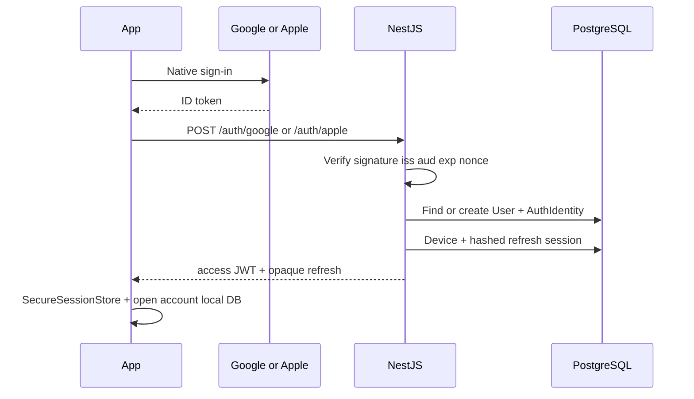
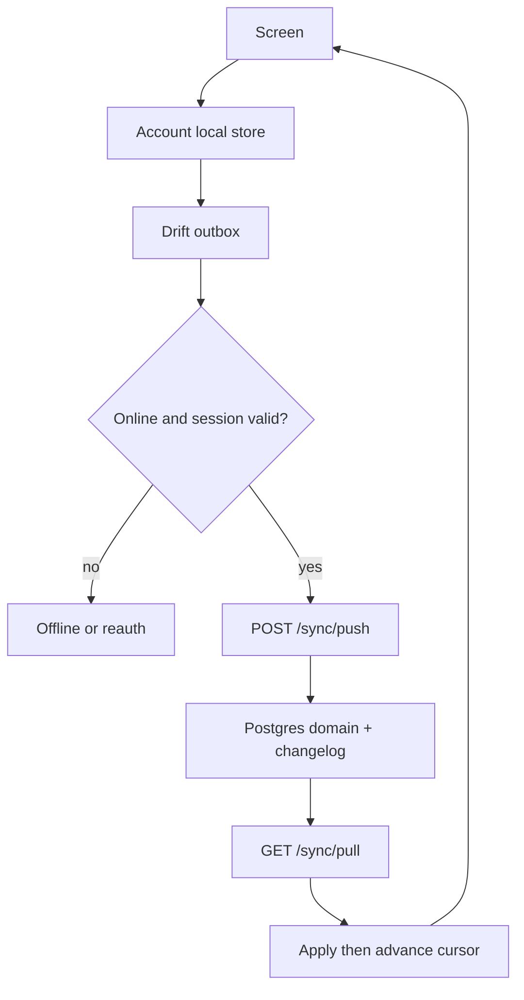

# Production authentication and offline-first sync

**Status:** Architecture freeze for the production-account milestone.  
**Baseline commit inspected:** `be5f630f32e44358e08a8e7f8215639428597bd1`  
**Working tree:** local-first v1 plus uncommitted settings/l10n/quick-add work. Not yet production-account.

This document describes (1) the repository as inspected and (2) the target architecture. Implementation must not contradict either.

---

## 1. Current repository (as-is)

### Product

MeMy v1 is a **device-local** companion. Production (`APP_ENV=production`) uses `AuthMode.none`: first launch is onboarding, returning launch is Today. There is no Google/Apple sign-in, no refresh token, no MeMy account, and `ReleaseCapabilities.cloudAccount` / `cloudSync` are **false**.

### Authentication

| Layer | Behavior |
| --- | --- |
| Production mobile | No session. Onboarding completion flag in SharedPreferences. |
| Development mobile | Fake Sign In / Sign Up / Forgot Password. Debug prefills `emma@memy.app` / `memy2026`. Any non-empty credentials navigate to Today. |
| NestJS | Global `DevAuthGuard`. Accepts `X-Dev-User-Id` or `Bearer dev <uuid>` matching `DEV_USER_ID`. **Refuses `NODE_ENV=production`** (`AUTH_PROVIDER_REQUIRED`). |
| Tokens | None. No `flutter_secure_storage`. |

### Persistence (no account namespace)

| Store | Schema | Notes |
| --- | --- | --- |
| Goals SharedPreferences `memy_goals_v1` | JSON v1 | Empty seed in production |
| Finance `memy_finance_v1` | JSON v3 | Built-in categories allowed; no demo transactions in production |
| Habits `memy_habits_v1` | JSON v2 | Empty in production |
| Wardrobe `memy_wardrobe_v1` | JSON v1 | Empty; images under app documents `wardrobe/` |
| Onboarding / profile / units / language / currency | prefs keys `memy_*_v1` | Device-wide |
| Appearance | `memy_theme_mode_v1`, `memy_reduce_motion_v1` | Device-wide |
| Health connection | prefs v2 | Device-local platform Health |
| Calendar Drift `memy_calendar` | schema v3 | Device calendar outbox + MeMy-owned events |
| API Prisma | User, Goal, GoalMilestone, GoalProgressEntry | Goals-only; single `DEV_USER_ID` in development |

### Backend

- NestJS `/api/v1` — Health, Goals, Today (goal summary).
- PostgreSQL 16 via root `docker-compose.yml` (host 5433). **Not a VPS stack.**
- No JWT, OAuth, MinIO, Dockerfile, reverse proxy, or `docs/deployment/`.
- Flutter `ApiGoalRepository` exists but production **forces** `GOALS_DATA_SOURCE=local`.

### Demo / seed surfaces still in tree

- `SignInScreen`, `SignUpScreen`, `ForgotPasswordScreen` (router-redirected in production).
- `Fake*Repository` for tests and non-production dart-defines.
- `GoalsSeed`, `FinanceSeed` demo transactions, `HabitsSeed`, `TodaySeed`, `UserSeed` (Emma), `CoachSeed`, `BodySeed`, `CalendarSeed` — gated by `shouldSeedDemoContent => !isProduction`.
- Copy leaks: drawer “Demo mode” default, More “Demo content”, Today “Sample preview”.
- Prototype HTML must remain in-repo as design reference and must **not** be the public production site.

### Boundaries already true (must keep)

- Raw HealthKit / Health Connect never leave the device.
- Imported device Calendar events never go to Nest.
- Wardrobe binaries are app-private files today (not object storage).
- Flutter never connects to PostgreSQL.

---

## 2. Target decisions

### Authentication providers

Production:

- Google Sign-In (Android + iOS)
- Sign in with Apple (iOS)

Deferred (must not appear in production UI):

- Facebook, email/password, phone, Microsoft, anonymous cloud accounts

Internal/screenshot builds may keep a **separate** developer login that is impossible when `APP_ENV=production`.

### Identity

Stable external identity = **`provider` + `providerSubject`**.  
Email is optional metadata. Matching emails **must not** auto-link Google and Apple accounts.

Backend verifies provider ID tokens (signature, issuer, audience, expiry, nonce where applicable). The client profile is never identity proof.

### Sessions

- Short-lived MeMy access JWT (in memory).
- Opaque rotating refresh token in **secure platform storage** only.
- PostgreSQL stores **hashes** of refresh tokens, not raw values.
- Reuse of a rotated refresh token revokes the token family.
- Logout revokes the current session; logout-all revokes the user’s sessions.

### First launch vs offline

```
Never signed in ──internet required──► Google / Apple ──► empty account local store
                                              │
Signed in once ──offline OK──► open local DB ──► mutate locally ──► outbox
                                              │
Token refresh fails offline ── keep local R/W, pause sync, do not wipe
```

### Local ownership

**Preferred:** one namespaced local store per backend `userId`:

- SharedPreferences prefix or dedicated file: `memy_<accountId>_…`
- Drift: `memy_calendar_<accountId>` and `memy_sync_<accountId>`
- Wardrobe files: `wardrobe/<accountId>/…`

Logout closes providers. Another account cannot open the previous cache. Signing back into A restores A.

### Existing device data (pre-account v1)

On first production sign-in, if unowned legacy keys/DB exist, show a **one-time** choice:

| Option | Behavior |
| --- | --- |
| A Move into my account | Re-home into account namespace, enqueue outbox, sync |
| B Start empty | Quarantine legacy backup; do not erase silently |
| C Decide later | Reminder; no mix; no upload |

Never merge automatically.

---

## 3. Sync architecture

### Source of truth

| Layer | Role |
| --- | --- |
| Local record store | Immediate UI source |
| Outbox | Pending mutations (Drift, not one JSON blob) |
| Nest + PostgreSQL | Authoritative **synced** copy after accept |
| Change log | Ordered pull feed (`userId + sequence`) |

Screens **never** block on the network to render.

### Sync infrastructure store (new Drift)

Tables (per account DB):

- `sync_mutations` (outbox)
- `sync_cursors`
- `sync_entity_meta` (localVersion, serverVersion, tombstone)
- `sync_conflicts`
- `sync_assets`
- `sync_runs` (sanitized)

Domain JSON modules keep working stores **plus** Option B: a startup reconciliation scan that reconstructs missing outbox rows after a crash. Calendar (already Drift) journals mutation + outbox in one transaction where practical.

Do not rewrite every module into Drift in this milestone unless a store cannot guarantee the outbox.

### Client algorithm (one lock per account)

1. Confirm session; refresh access token if needed.
2. Push bounded outbox batch (`POST /api/v1/sync/push`) — idempotent `mutationId`.
3. Apply accepts; store conflicts; mark validation failures `permanentlyFailed`.
4. Pull (`GET /api/v1/sync/pull?cursor&limit`) until `hasMore` is false.
5. Apply locally; **advance cursor only after apply succeeds**.
6. Update status; release lock.

Triggers: sign-in, startup, resume, connectivity restored, debounced local mutation, Sync Now, before export. No continuous poll. Background sync is best-effort only; the guarantee is **foreground + next launch**.

### IDs, versions, clocks

- Client-generated UUIDs for offline creates.
- Optimistic `baseServerVersion` on update/delete.
- Server assigns `serverVersion` and `sequence`.
- Client clocks are **not** the conflict authority.

### Conflicts

Never silent overwrite for: finance transactions/budgets, wardrobe metadata when image state differs, MeMy-owned calendar events, profile identity fields.

UI: Keep local / Keep server / Keep both where safe.  
Preferences: last server-received write wins (no UI unless security-sensitive).

### Tombstones

Local delete → tombstone + outbox delete. Server delete → change-log delete. Pull applies tombstone. Cursor does not skip unapplied deletes.

### Derived UI

Today and Plan are **not** sync entities. They compose local Goals, Finance, Habits, Calendar, Health, Weather.

---

## 4. What synchronizes vs stays local

### Synchronize (app-owned)

Profile, avatar key, preferences (currency, units, language, week start, timezone, appearance, wardrobe prefs, weather city preference), goals + milestones + progress, finance custom categories + transactions + budgets + money positions/payments, habits + check-ins + schedule revisions + status periods, wardrobe metadata + outfits + plans + wear records + **asset IDs**, MeMy-owned calendar **metadata**, exercise history only if the feature already persists it.

### Never synchronize

Raw Health samples/workouts/sleep, Health permission payloads, imported device calendar events, device calendar account/link IDs, precise GPS, debug diagnostics, support reports, temp files, screenshot seeds.

Wardrobe payloads store `backendAssetId`, never absolute paths or EXIF.

---

## 5. Backend API (target)

### Auth

```
POST /api/v1/auth/google
POST /api/v1/auth/apple
POST /api/v1/auth/refresh
POST /api/v1/auth/logout
POST /api/v1/auth/logout-all
GET  /api/v1/me
GET  /api/v1/me/devices
DELETE /api/v1/me/devices/:deviceId
GET  /api/v1/me/export
DELETE /api/v1/me
```

Production startup **must not** register `DevAuthGuard`. Development may keep it behind `NODE_ENV=development`.

### Sync

```
POST /api/v1/sync/bootstrap
POST /api/v1/sync/push
GET  /api/v1/sync/pull
```

Every domain write and change-log row in **one PostgreSQL transaction**.  
`SyncMutationReceipt` unique on `(userId, mutationId)`.

### Assets

```
POST /api/v1/assets/prepare-upload
POST /api/v1/assets/:id/complete
GET  /api/v1/assets/:id/download
DELETE /api/v1/assets/:id
```

Private S3-compatible storage (MinIO on the VPS). Signed URLs. Opaque object keys. No public bucket.

### Prisma (add, non-destructive)

Extend `User` (status, avatarKey, lastSignedInAt, deletedAt). Add `AuthIdentity`, `Device`, `RefreshSession`, `AuthAuditEvent`, sync record tables + `SyncChangeLog` + `SyncMutationReceipt` + `Asset`.

Keep existing Goal tables; they become one synced entity family owned by `userId`.

---

## 6. Mobile session store

```dart
abstract interface class SecureSessionStore {
  // refresh token, userId, deviceId, lastAuthAt, provider
}
```

Never store Google/Apple identity tokens after exchange. Never put refresh tokens in SharedPreferences.

Device ID: random UUID in secure/protected config, not advertising or hardware IDs. Registered after sign-in. Not shown in UI.

---

## 7. UX

Production Sign In: Continue with Google, Continue with Apple (iOS), Privacy, Terms, offline explanation, loading/cancel/error/retry. No demo, no Facebook, no fake forms.

Sync status (shell / Settings / Connected Apps / Profile): Synced, Syncing, Offline — changes saved on this device, Pending, Sign in required to sync, Error, Conflict needs review.

Routes: `/sync`, `/sync/conflicts`, `/sync/conflicts/:id`.

Logout: keep local cache **or** remove this account’s local data. Warn on pending outbox. Bounded sync attempt when online.

Delete account: typed `DELETE MY ACCOUNT`, recent reauth, truthful Health/Calendar remainder, backend + assets + sessions.

Export: local device vs synchronized account; warn if outbox pending.

Empty states for new accounts: first goal / transaction / habit / wardrobe item — **not** persisted examples.

---

## 8. VPS topology

```
Internet
  :80/:443  reverse proxy (Caddy or Nginx) + TLS
       ├── api.<domain>  → NestJS
       └── www.<domain>  → landing + legal (not the HTML prototype)
Internal Docker network
  ├── postgres (no public port)
  ├── minio (no public console)
  └── api
```

Pinned images, health checks, persistent volumes, env files **outside Git**.  
Backups: PostgreSQL + object data; restore procedure required before a backup is “valid”.  
Staging: separate DB, bucket, OAuth clients, JWT keys, domain.

Flutter talks **only** to `https://<api>/api/v1`.

---

## 9. Module conflict defaults

| Module | Policy |
| --- | --- |
| Preferences | Server-received wins |
| Goals / milestones | Version conflict → review |
| Finance tx / budgets / money owed | Version conflict → review (never silent) |
| Habits / check-ins | Same-day check-in deterministic or review |
| Wardrobe metadata + images | Review if asset state differs |
| MeMy calendar metadata | Review; device EventKit conflicts stay separate |
| Health | Not a sync entity |

---

## 10. Failure recovery

| Failure | Behavior |
| --- | --- |
| Offline first sign-in | Block with clear copy |
| Offline after sign-in | Full local R/W; status Offline |
| 401 | One refresh; then `requiresAuthentication`; keep local data |
| 5xx / network | Exponential backoff; outbox preserved |
| Validation | `permanentlyFailed` + user-visible |
| Crash mid-pull | Cursor unchanged; replay pull |
| Crash mid-push | Idempotent mutationId |
| Refresh reuse | Revoke family |
| Wrong account | Never upload outbox belonging to another userId |

---

## 11. Account deletion and export

Deletion: backend rows + object assets (or deletion-pending if cleanup lags) + revoke sessions + clear local account namespace. Health platform and imported calendars remain on the OS.

Export: versioned manifest of **app-owned** backend records. No raw Health, no imported calendar, no tokens. Images metadata yes; binaries only via explicit asset export.

---

## 12. Diagrams

### Auth



### Sync



---

## 13. Implementation order (locked)

A Inspect + baseline → B this document → C remove production demo/seeds → D Prisma auth models → E Google → F Apple → G account isolation → H mobile outbox → I sync APIs → J module adapters → K wardrobe assets → L status/logout/export/deletion UX → M VPS → N privacy → O tests → P verify.

Do not enable `cloudSync` in production until adapters for the listed entities exist and cross-user tests pass. Ship auth + empty accounts + isolation before the first live push if needed, but production Sign In must not claim “synced” until pull/push works.

---

## 14. Contradictions avoided

- v1 docs saying “no account” are **superseded** by this milestone; privacy/legal drafts must be updated in the same change set.
- `ReleaseCapabilities.cloudAccount` / `cloudSync` become true in production once this milestone’s gates pass.
- Goals API remains; it is folded under authenticated user ownership, not a second identity.
- Device Calendar outbox stays; it is **not** the MeMy cloud outbox.
- Prototype HTML stays in git; public deploy config must not serve it as the product.
